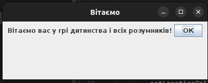
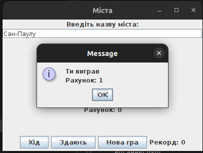
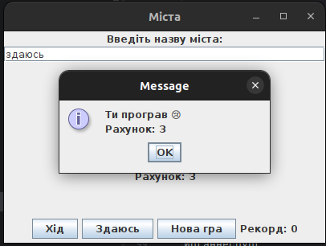

# Гра "Міста"

## Описання
Проект є реальзаціїю гри "Міста", в якій люди називають назви міст, які починаються на останню букву попереднього.

## Контекст
Проект виконаний по технічному завданню(ТЗ)

## Стек
Мова- Java
Бібліотеки:
java.awt
java.swing

## Як запустити
1. Склонувати репозиторій
   git clone<link>
2. Перейти в папку проекта
cd <name>
3. Переконайтесь, що встановлено Java 17 (JDK 17)
4. Запустіть проєкт:
   - через IDE (наприклад IntelliJ IDEA), або
   - запустіть головний клас (Main)
   
## Приклади роботи

### Головне меню

### Ігровий процес

### Вікно перемоги / поразки

## Що зробив я

- реалізував логіку створення вікон (UI) та взаємодії з користувачем
- розділив проєкт на пакети (стартове вікно, ігрова логіка)
- реалізував логіку гри: перевірка відповідей користувача, обробка перемоги та поразки
- додав генерацію назв міст для комп’ютера
- реалізував перевірку введених даних (існування міста, правильність назви)
- додав обробку дії "здаюсь"
- реалізував читання списку міст із файлу
- оптимізував роботу з файлами та структуру коду
- збільшив базу міст до 100+
## Покращення від себе
-Додав кнопки для початку Нової гри та для програшу користувача з прописаною логікою для них
- покращив структуру проєкту (розділення логіки на пакети)
- оптимізував роботу з файлами
- розширив базу даних міст для більшої варіативності гри
  
